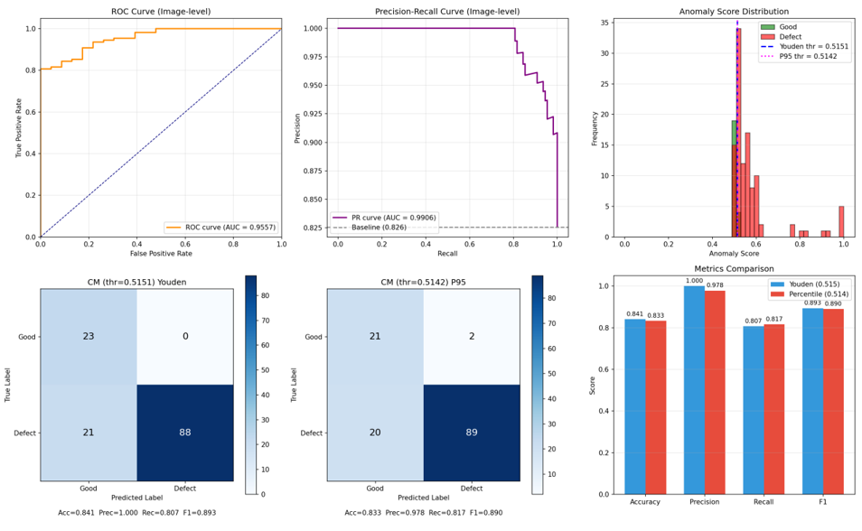

# EfficientAD Web App (FastAPI + Nuxt UI)

A web application for surface anomaly detection on capsules using the EfficientAD model. The project consists of a FastAPI backend for inference and a Nuxt UI frontend, allowing users to easily upload images, adjust the detection threshold, and inspect detailed defect results.

## App Overview

The web interface supports:
- Uploading an input image and adjusting the threshold (0–1).
- Previewing the original image.
- Prediction summary: anomaly score, label (Defect/Good), defect type, defect count, and largest defect area.
- Visualizations: Anomaly Map, Image + Anomaly Map overlay, Predicted Mask, and Contours (OpenCV).


## Setup & Run

> **Note:** This project is fixed to the **capsule** model at `checkpoints/capsule.ckpt`.

### 1. Prepare the checkpoint

After training in the original repo ([surface-efficientad-model](https://github.com/KhanhNguyenVimaru/surface-efficientad-model)), copy the checkpoint into this project:

```bash
checkpoints/capsule.ckpt
```

### 2. Run the Backend (FastAPI)

Install dependencies:

```bash
pip install -r requirements.txt
```

Start the server:

```bash
uvicorn app:app --reload --host 0.0.0.0 --port 8000
```

- API docs: [http://localhost:8000/docs](http://localhost:8000/docs)
- Main endpoints:
  - `GET /health`
  - `GET /models`
  - `POST /predict` (multipart form: `image`, `threshold`)

### 3. Run the Frontend (Nuxt)

```bash
cd web
npm install
npm run dev
```

Access the frontend: [http://localhost:3000](http://localhost:3000)

---

## Evaluation Metrics Overview

The EfficientAD model is evaluated on the **capsule** dataset with comprehensive performance metrics, including ROC curve, Precision–Recall curve, anomaly score distribution, confusion matrices, and a metrics comparison (Accuracy, Precision, Recall, F1) across optimal thresholds.

See the full evaluation report at: [BAO_CAO_EVALUATION.md](https://github.com/KhanhNguyenVimaru/surface-efficientad/blob/main/docs/BAO_CAO_EVALUATION.md)


