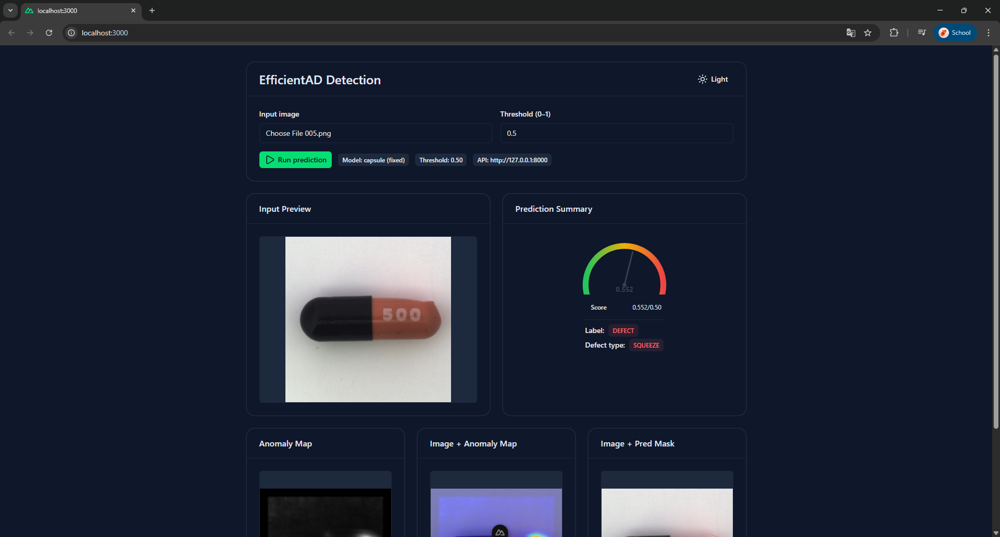

# EfficientAD Web App (FastAPI + Nuxt UI)

This project is fixed to **capsule-only inference** using `checkpoints/capsule.ckpt`.

## Demo

| Prediction Summary | Anomaly Visualization |
|---|---|
|  |  |

> **Note:** Run `python tests/run_all_tests.py` to regenerate evaluation charts.

## 1. Train Capsule Model (Original Repo)

Original training repo:
`https://github.com/KhanhNguyenVimaru/surface-efficientad-model`

Colab training command:

```bash
%cd /content/surface-efficientad-model

!python train_efficientad.py \
  --data-root /content \
  --category capsule \
  --max-epochs 30 \
  --batch-size 1 \
  --image-size 256 \
  --devices 1 \
  --accelerator gpu \
  --model-size s
```

## 2. Copy Checkpoint

After training, copy checkpoint into this project:

```bash
checkpoints/capsule.ckpt
```

## 3. Run Backend (FastAPI)

Install dependencies:

```bash
pip install -r requirements.txt
```

Run server:

```bash
uvicorn app:app --reload --host 0.0.0.0 --port 8000
```

API docs:
`http://localhost:8000/docs`

### Backend APIs

- `GET /health`
- `GET /models`
- `POST /predict` (multipart form: `image`, `threshold`)

## 4. Run Frontend (Nuxt)

```bash
cd web
npm install
npm run dev
```

Frontend URL:
`http://localhost:3000`
